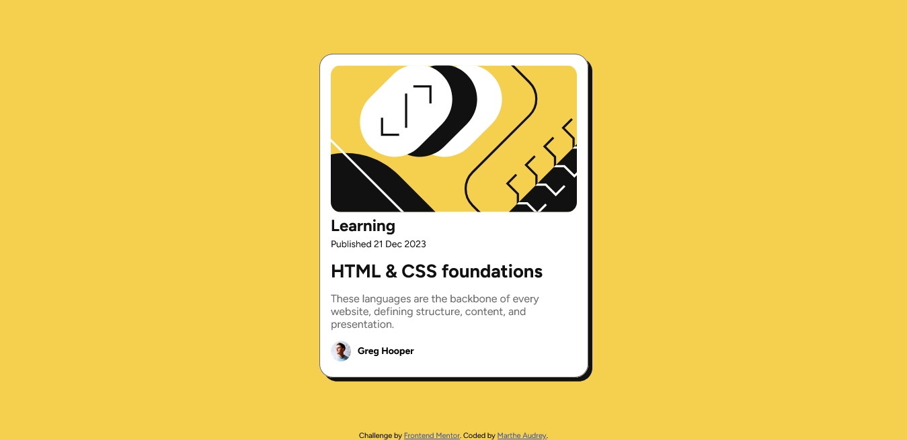

# Frontend Mentor - Blog preview card solution

This is a solution to the [Blog preview card challenge on Frontend Mentor](https://www.frontendmentor.io/challenges/blog-preview-card-ckPaj01IcS). Frontend Mentor challenges help you improve your coding skills by building realistic projects. 

## Table of contents

- [Overview](#overview)
  - [The challenge](#the-challenge)
  - [Screenshot](#screenshot)
  - [Links](#links)
- [My process](#my-process)
  - [Built with](#built-with)
  - [What I learned](#what-i-learned)
  - [Continued development](#continued-development)
  - [Useful resources](#useful-resources)
- [Author](#author)


## Overview

### The challenge

Users should be able to:

- See hover and focus states for all interactive elements on the page

### Screenshot



Add a screenshot of your solution. The easiest way to do this is to use Firefox to view your project, right-click the page and select "Take a Screenshot". You can choose either a full-height screenshot or a cropped one based on how long the page is. If it's very long, it might be best to crop it.

Alternatively, you can use a tool like [FireShot](https://getfireshot.com/) to take the screenshot. FireShot has a free option, so you don't need to purchase it. 

Then crop/optimize/edit your image however you like, add it to your project, and update the file path in the image above.


### Links

- Solution URL: [Add solution URL here](https://your-solution-url.com)
- Live Site URL: [Add live site URL here](https://your-live-site-url.com)

## My process

### Built with

- Semantic HTML5 markup
- CSS custom properties
- Flexbox

### What I learned

Through this project, I have learned how to make text responsive without using media queries. I did some research and found about the clamp function. I watched some YouTube tutorials on the subject and learned more about it on w3 schools.
It used to set a value that will ajust responsively between a minimum value and a maximum value depending on the size of the viewport.

Code snipets of how I used the clamp function below:

```css

.card-text h3{
    margin: 5px 0;
    font-size: clamp(1.17rem, 2.5vw, 1.5rem);
}

.card-text p:nth-child(2){
    font-size: clamp(14px, 1vw, 16px);
}

.card-text h2{
    font-size: clamp(1.5rem , 2vw, 2rem);
}

```

### Continued development

On this learning path, I intend to continue to practice on the clamp function to get better and learn how 
to make the websites I code accessible.

### Useful resources

- [CSS clamp Function()](https://www.w3schools.com/cssref/func_clamp.php) - This helped to learn more about clamp function.
- [CSS clamp() Function Explained in 5 mins. Complete Tutorial for Beginners](https://www.youtube.com/watch?v=rIOIeoX6QNw) - This is the YouTube tutorial I listened to see how 
the clamp function is used practically.

## Author

- Frontend Mentor - [@MartheAudrey](https://www.frontendmentor.io/profile/MartheAudrey)

